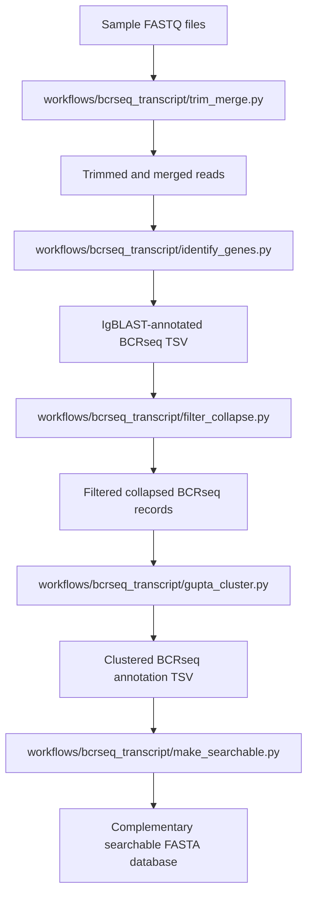
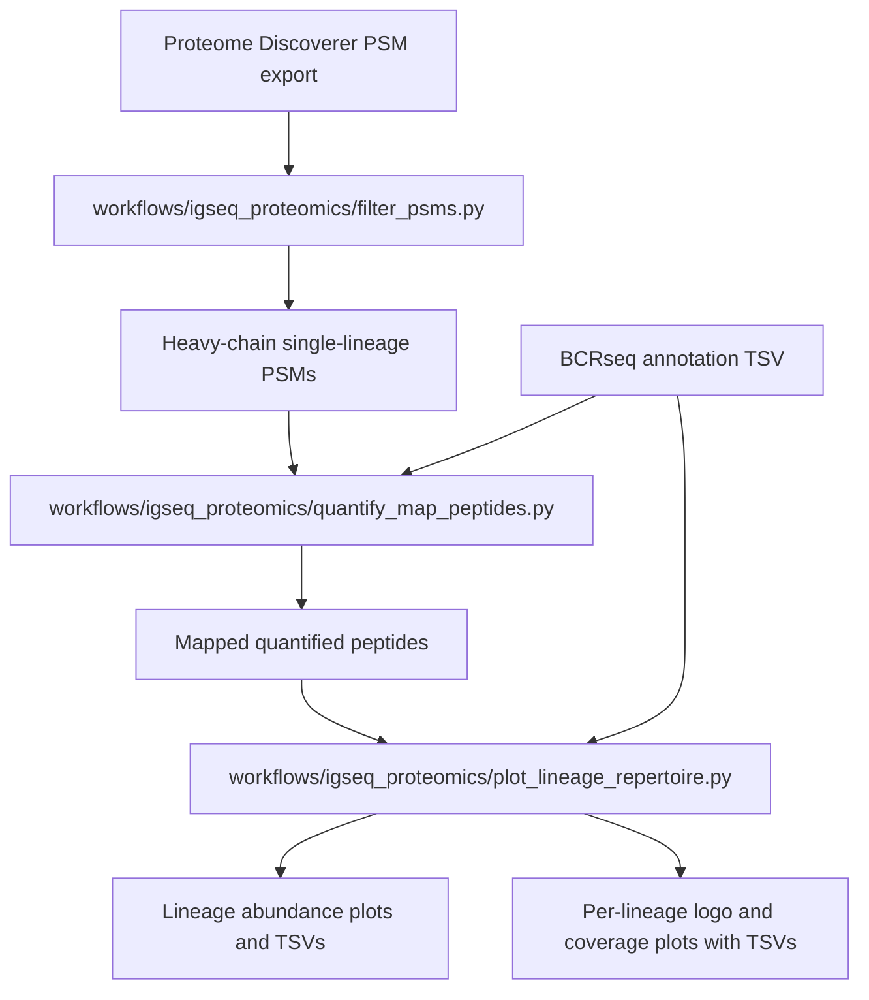

# BCR Transcript Sequencing and Immunoglobulin Protein Sequencing Pipeline

This repository contains two supported workflows:

- `BCR-seq Transcript Analysis` for processing sequencing reads into clustered BCR annotations and searchable FASTA databases.
- `Ig-seq Bottom-up Proteomic Analysis` for filtering Proteome Discoverer PSM exports, quantifying mapped peptides, and visualizing lineage-level protein evidence.

## Python environment

This project uses a standard Python virtual environment plus `requirements.txt`.

Create and activate a local environment from the repository root:

```bash
python3 -m venv .venv
source .venv/bin/activate
python -m pip install --upgrade pip
python -m pip install -r requirements.txt
```

Then run scripts with the activated environment's `python`.

## Official workflow files

| Workflow | Official entry files |
| --- | --- |
| BCR-seq Transcript Analysis | `workflows/bcrseq_transcript/bcrseq_pipeline.py`, `workflows/bcrseq_transcript/pipeline_config_template.json` |
| Ig-seq Bottom-up Proteomic Analysis | `workflows/igseq_proteomics/filter_psms.py`, `workflows/igseq_proteomics/quantify_map_peptides.py`, `workflows/igseq_proteomics/plot_lineage_repertoire.py` |
| Secondary analysis utilities | `analysis_utils/` |

Repository layout:

- `workflows/bcrseq_transcript/` contains the transcript-side pipeline entrypoints and stage scripts.
- `workflows/igseq_proteomics/` contains the proteomics-side filtering, mapping, and plotting scripts.
- `examples/` contains example configs, example commands, and fixture inputs for onboarding.
- `analysis_utils/` contains secondary helper scripts that are not the main onboarding entrypoints.

## BCR-seq Transcript Analysis



Start here if you have paired-end transcript sequencing reads and want clustered BCR annotations plus a searchable FASTA database.

Transcript quickstart:

```bash
python workflows/bcrseq_transcript/bcrseq_pipeline.py \
  examples/fixtures/transcript \
  examples/configs/transcript_dry_run_config.json \
  --dry_run
```

This bundled transcript example is a dry-run wiring check. It demonstrates sample discovery, config resolution, and stage command construction.

## Ig-seq Bottom-up Proteomic Analysis



Start here if you already have a Proteome Discoverer PSM export and a clustered BCRseq annotation TSV.

Proteomics quickstart:

```bash
python workflows/igseq_proteomics/filter_psms.py \
  examples/fixtures/proteomics/demo_psms.tsv \
  --out-dir scratch/proteomics_example/01_filtered

python workflows/igseq_proteomics/quantify_map_peptides.py \
  scratch/proteomics_example/01_filtered/demo_psms_filtered_heavy_single_lineage.tsv \
  examples/fixtures/proteomics/demo_bcrseq.tsv \
  examples/fixtures/proteomics/demo_suffix.txt \
  --out-dir scratch/proteomics_example/02_mapped

python workflows/igseq_proteomics/plot_lineage_repertoire.py \
  scratch/proteomics_example/02_mapped/demo_psms_filtered_heavy_single_lineage_mapped_peptides.tsv \
  examples/fixtures/proteomics/demo_bcrseq.tsv \
  --out-dir scratch/proteomics_example/03_plots
```

## Examples and fixtures

- [examples/README.md](examples/README.md) describes the bundled example inputs and what each one is intended to validate.
- `examples/fixtures/transcript/` contains a transcript dry-run fixture for sample naming and config validation.
- `examples/fixtures/proteomics/` contains a runnable proteomics example.
