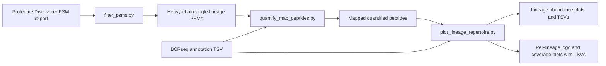
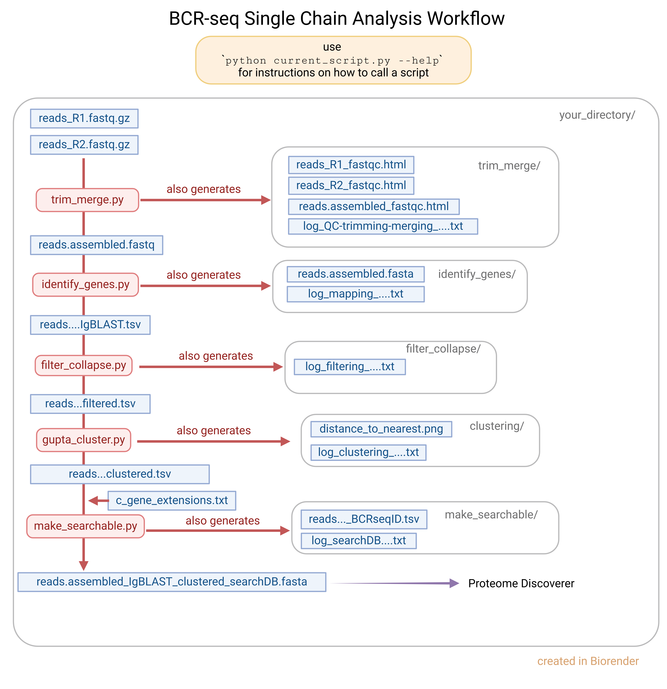

# BCR Transcript Sequencing and Immunoglobulin Protein Sequencing Pipeline

- An in-depth README.md file is pending.

- The scripts available here are stable if not perfect and there are many downstream scripts to come (see the TODO.md file for examples)

## Python environment

This project now uses a standard Python virtual environment plus
`requirements.txt` rather than a conda environment export.

Create and activate a local environment from the repository root:

```bash
python3 -m venv .venv
source .venv/bin/activate
python -m pip install --upgrade pip
python -m pip install -r requirements.txt
```

Then run scripts with the activated environment's `python`.

## Conceptual workflow




