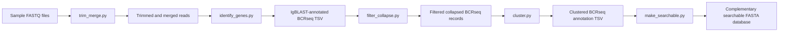
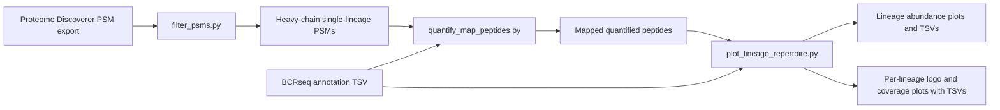

# BCR Transcript Sequencing and Immunoglobulin Protein Sequencing Pipeline

## Python environment

This project now uses a standard Python virtual environment plus
`requirements.txt` rather than a conda environment export.

Create and activate a local environment from the repository root:

```bash
python3 -m venv .venv
source .venv/bin/activate
python -m pip install --upgrade pip
python -m pip install -r requirements.txt
```

Then run scripts with the activated environment's `python`.

## BCR-seq Transcript Analysis



## Ig-seq Bottom-up Proteomic Analysis


